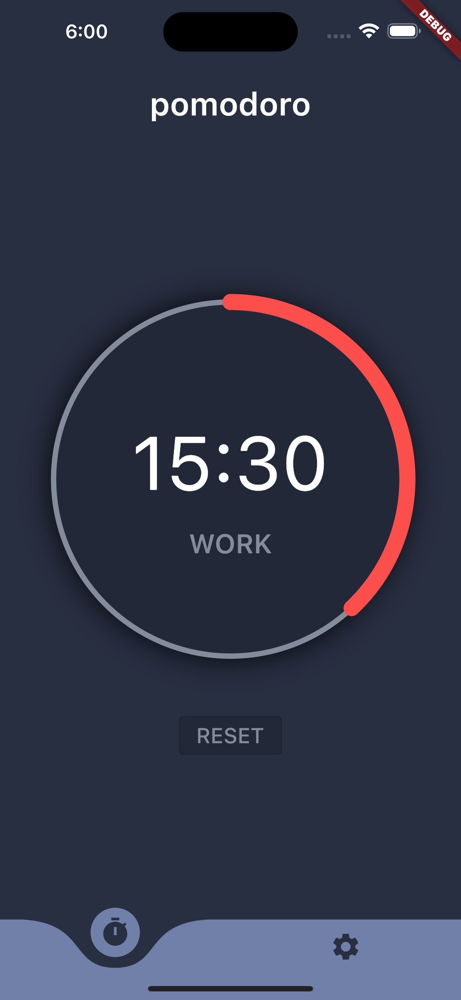
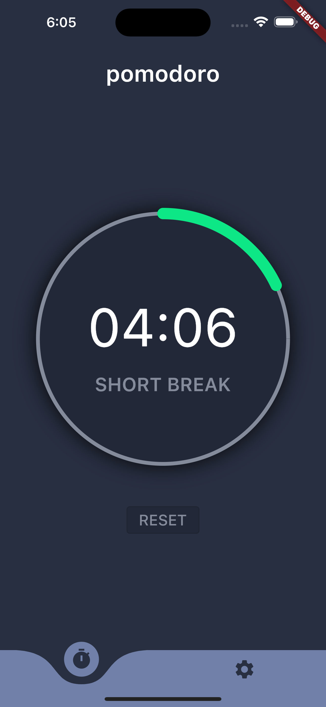
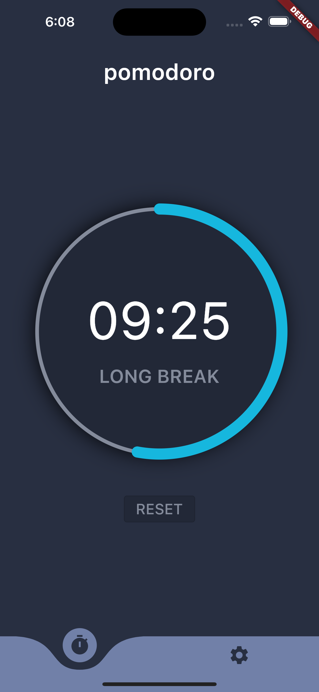
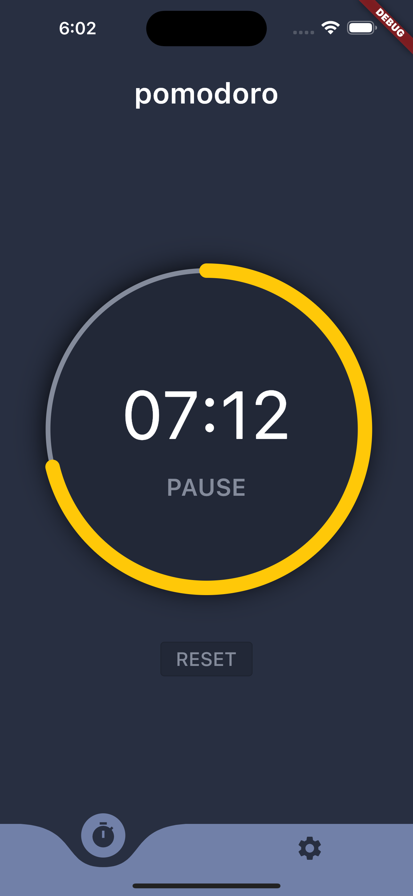
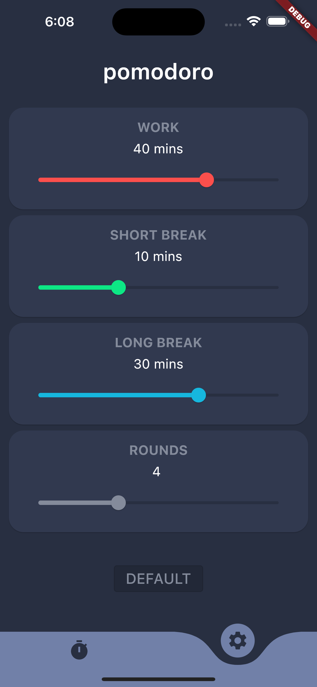

# pomodoro_app

Pomodoro App Project.

## Getting Started

The original technique has six steps:

1. Decide on the task to be done.
2. Set the Pomodoro timer (typically for 25 minutes).
3. Work on the task.
4. End work when the timer rings and take a short break (typically 5–10 minutes).
5. If you have finished fewer than three pomodoros, go back to Step 2 and repeat until you go through all three pomodoros.
6. After three pomodoros are done, take the fourth pomodoro and then take a long break (typically 20 to 30 minutes). Once the long break is finished, return to step 2.

